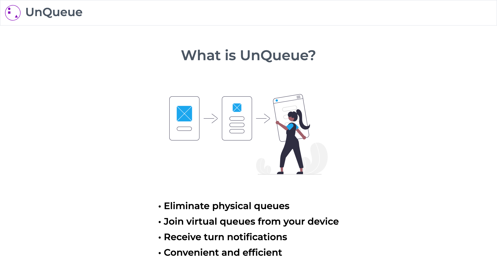
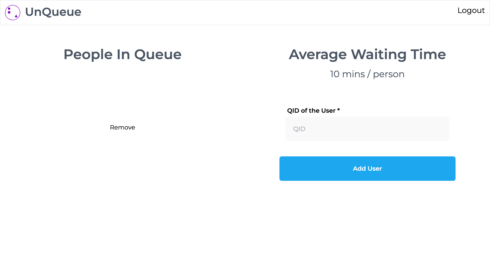

# UnQueue

UnQueue eliminates physical queues by joining virtual queues from your device, receive turn notifications, making it convenient and efficient.

## Steps to run it on your machine

1. Enter `git clone https://github.com/thisisyashgarg/unqueue-lts.git`
2. `npm init -y` to initialise npm.
3. `npm i` to install all the dependencies.
4. `npm start` to run the project.

## Screenshots

